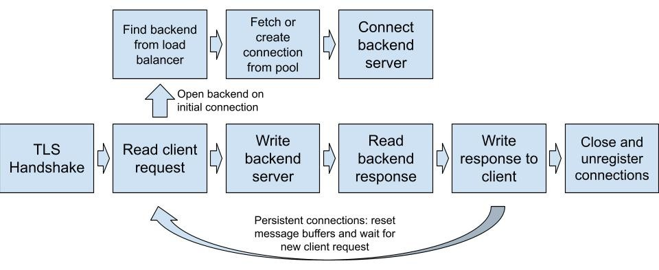

# multiplexed-reverse-proxy
High performance reverse proxy server using only the Python standard library  
*Compatible with [http server](https://github.com/davidmenggx/simple-http) instances*  
Single-threaded event loop architecture (I/O multiplexing) to handle concurrent connections efficiently  
Uses finite state object to manage connection lifecycle with low memory overhead
## Features
- I/O multiplexing with Python `selectors`
- Uses finite state machine to manage socket interactions, partial reads/writes, and slow clients
- Upstream and downstream **persistent connections** to reduce TCP latency
- Thread-safe **connection pool** for backend with JIT socket health checks, background cleanup of stale connections
- Multiple **load balancing algorithms** (IP hash, round robin, least connections)
- **TLS termination**
- **Dual stack** IPv6 and IPv4
- HTTP/1.1 compliant
## Architecture
Uses non-blocking sockets encapsulated in `ConnectionContext` object  
Connection flow:  

